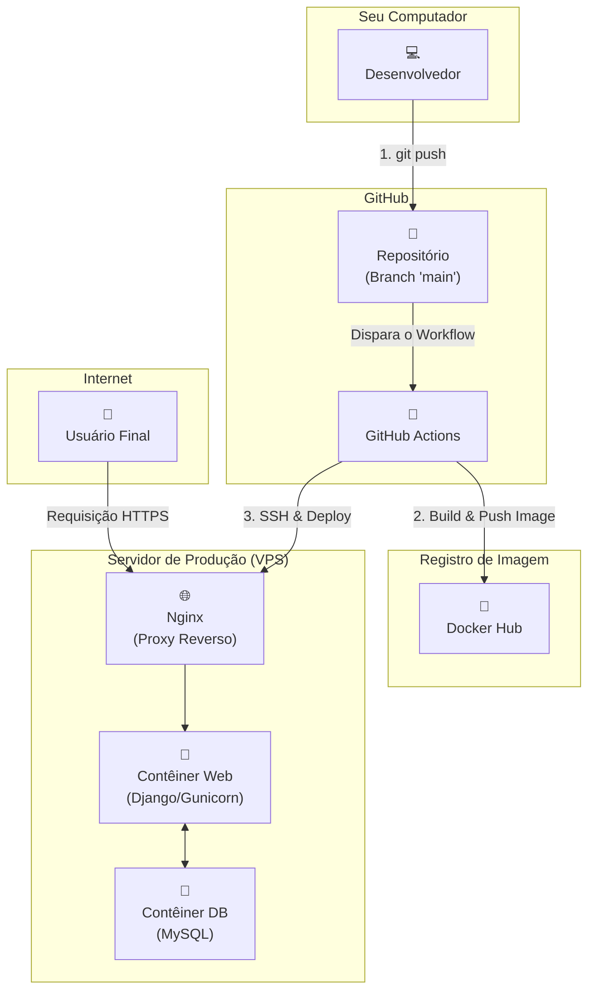

# Pipeline de CI/CD para Aplicações Django com Docker, Nginx e GitHub Actions

Este repositório demonstra um pipeline de Integração Contínua e Entrega Contínua (CI/CD) completo para uma aplicação web Django. O objetivo é automatizar todo o processo de deploy: a cada `push` para a branch `main`, o GitHub Actions automaticamente constrói uma imagem Docker, envia para um registro e atualiza a aplicação em um servidor de produção (VPS) que roda por trás de um proxy reverso Nginx com HTTPS.

## Arquitetura do Pipeline

O diagrama abaixo ilustra o fluxo completo, desde o `push` do desenvolvedor até a atualização da aplicação no servidor para o usuário final.

### Tecnologias Utilizadas
Backend: Django, Django Rest Framework

Servidor de Aplicação: Gunicorn

Banco de Dados: MySQL 8.0

Containerização: Docker, Docker Compose

Servidor Web / Proxy Reverso: Nginx

CI/CD: GitHub Actions

Certificado SSL: Certbot (Let's Encrypt)

Servidor: VPS com Ubuntu

### Pré-requisitos
Para replicar este projeto, você precisará de:

Um servidor (VPS) com acesso root/sudo e pelo menos 2GB de RAM.

Um nome de domínio apontando para o IP do seu servidor.

Uma conta no GitHub.

Uma conta no Docker Hub.

### Guia de Configuração Passo a Passo
Esta seção detalha as principais fases da configuração.

### Fase 1: Preparação do Servidor
Segurança Inicial: Crie um usuário com privilégios sudo para administração e um usuário deployer sem sudo para o deploy. Desative o login via senha para o usuário root.

Instalação de Ferramentas: Instale Docker, Docker Compose, Nginx e Certbot no servidor.

Permissões Docker: Adicione o usuário deployer ao grupo docker com sudo usermod -aG docker deployer para que ele possa executar comandos do Docker.

Autenticação SSH: Gere um par de chaves SSH na sua máquina local. Adicione a chave pública ao arquivo ~/.ssh/authorized_keys do usuário deployer no servidor. A chave privada será usada como um segredo no GitHub.

Configuração do Nginx: Configure um arquivo em /etc/nginx/sites-available/ para o seu domínio, definindo-o para atuar como proxy reverso. Crie blocos location para encaminhar o tráfego da aplicação para a porta do contêiner Docker (ex: 127.0.0.1:8000) e para servir arquivos estáticos (/static/) e de mídia (/media/) diretamente.

Configuração do HTTPS: Use o sudo certbot --nginx para gerar um certificado SSL gratuito e configurar o HTTPS automaticamente.

### Fase 2: Configuração do Projeto Django
Estrutura de settings: O arquivo settings.py foi dividido em um pacote (settings/) com os arquivos base.py (configurações comuns), development.py (para o ambiente local) e production.py (para o deploy). O manage.py é configurado para usar development, enquanto o wsgi.py é configurado para usar production.

Variáveis de Ambiente: Todas as informações sensíveis (SECRET_KEY, DB_PASSWORD, etc.) foram removidas do código e são carregadas de variáveis de ambiente usando os.getenv(). Em desenvolvimento, a biblioteca python-dotenv é usada para carregar essas variáveis de um arquivo .env.

Arquivos Estáticos e de Mídia: As variáveis STATIC_ROOT, STATIC_URL, MEDIA_ROOT e MEDIA_URL foram configuradas em base.py para funcionar com o Nginx em produção.

### Fase 3: Containerização com Docker
Dockerfile: Um Dockerfile de estágio único foi criado para construir a imagem da aplicação. Ele define a versão do Python, instala as dependências do requirements.txt, copia o código e executa collectstatic.

docker-compose.yml: Define os dois serviços principais da aplicação (web e db), a rede privada entre eles e os volumes para persistência dos dados.

mysql.txt (Script de Inicialização): Um script SQL é mapeado para a pasta /docker-entrypoint-initdb.d/ do contêiner MySQL para executar configurações personalizadas (como criar PROCEDURES e EVENTS) na primeira vez que o banco de dados é criado.

### Fase 4: Pipeline de CI/CD com GitHub Actions
GitHub Secrets: Todas as variáveis de ambiente necessárias para o deploy (credenciais de SSH, do Docker Hub, do Django e do banco de dados) foram cadastradas como segredos no repositório em Settings > Secrets and variables > Actions.

.github/workflows/deploy.yml: O arquivo de workflow define os passos da automação:

Gatilho: O pipeline é acionado a cada push na branch main.

Build & Push: Constrói a imagem Docker e a envia para o Docker Hub.

Deploy: Conecta-se ao servidor via SSH e executa um script que:

Cria os arquivos de configuração (.env, docker-compose.yml, mysql.txt) no servidor a partir dos segredos do GitHub.

Limpa o ambiente antigo (docker compose down -v) para garantir um deploy limpo.

Baixa a nova imagem (docker pull).

Sobe os novos contêineres (docker compose up -d).

Espera o banco de dados ficar pronto com um loop de "espera inteligente".

Executa os comandos de gerenciamento (migrate, create_admins, collectstatic) com as configurações de produção.

Como Usar
Após seguir toda a configuração acima, qualquer git push para a branch main irá automaticamente atualizar a aplicação no servidor de produção.

Bash

git push origin main
Acompanhe a execução na aba "Actions" do seu repositório.

Lições Aprendidas e Problemas Comuns
Durante o desenvolvimento deste pipeline, encontramos e resolvemos vários problemas comuns em ambientes de deploy:

Inconsistência de Caminhos: O principal desafio foi alinhar os caminhos de arquivos (static/, media/) entre o STATIC_URL (Django), volumes (Docker Compose) e alias (Nginx). A solução foi padronizar e usar caminhos consistentes e explícitos em todas as configurações.

"Condição de Corrida" do Banco de Dados: O comando migrate falhava porque a aplicação tentava se conectar ao MySQL antes que ele estivesse pronto. A solução foi substituir uma espera fixa (sleep) por um loop de "espera inteligente" que testa a conexão com o banco antes de prosseguir.

Diferenças de Ambiente (Dev vs. Prod):

Configurações: O manage.py carregava as configurações de desenvolvimento no servidor, causando erros. A solução foi forçar o uso das configurações de produção nos comandos de deploy com a flag -e DJANGO_SETTINGS_MODULE=....

Case Sensitivity: Arquivos não eram encontrados (erro 404) devido a diferenças de maiúsculas/minúsculas entre o sistema de arquivos do Windows (insensível) e do Linux (sensível).

Permissões de Pasta no Servidor: O upload de arquivos de mídia falhava porque o contêiner Docker não tinha permissão de escrita no diretório de media no servidor. A solução foi corrigir o dono da pasta com sudo chown.

Dependências de Produção e Versões: Erros como "gunicorn" not found ou conflitos de versão do Django aconteceram porque pacotes essenciais para produção não estavam no requirements.txt ou eram incompatíveis com a versão do Python no Dockerfile. A lição é manter o requirements.txt atualizado e garantir a compatibilidade entre as versões.

Recursos do Servidor: O travamento do comando migrate foi diagnosticado como um esgotamento de recursos (CPU/RAM) em um servidor VPS pequeno. A solução foi fazer o upgrade do servidor para um plano com mais memória.